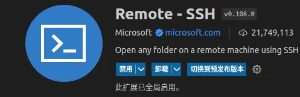
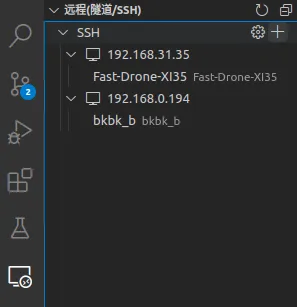
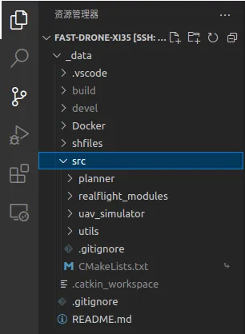

本篇记录 XI35 机体的组装过程，以及飞控、ORIN的配置，最终实现 fast-drone-250 的过程。

所有的 `配件型号` 及 `相关资料` 可在 [配件型号采购表](https://docs.qq.com/sheet/DQlVFVXBTYkpobktF?u=4ce3cf3cb1fc4960917789399c899a1a&tab=bliok2) 中找到。

> 总重 540g -> 780g（安装了相机和orin）

目录：
- [1 机体安装步骤](#1-机体安装步骤)
- [2 飞控配置](#2-飞控配置)
- [3 orin nx 配置](#3-orin-nx-配置)
- [4 docker 配置与使用](#4-docker-配置与使用)
- [5 需要注意的问题](#5-需要注意的问题)
- [参考](#参考)

## 1 机体安装步骤

### 1.1 整体流程

- 将电机安装到机架上，使用四个M2*6，注意机架的上下面，孔位有凹槽的为上面

- 穿电池绑带

- 将M3转M2橡胶减震柱穿过电驱和飞控的四角安装孔（技巧：橡皮筋技巧）

- 使用M2*20安装电驱，8pin接口朝机头，接口贴着机架			

- 电机线修修剪（用剥线钳），焊接(加松香)；电源线和滤波电容焊接

- 连接飞控（见下面QCG版本问题），连接电池，更改电机序号映射和转向

- 连接接收机（遥传一体模块中靠近LED的是RC接口）到飞控的 RC 端口，数传（遥传一体模块中的另一个接口）到 TELEM1 端口，GPS模块连接 到 GPS 端口

- 线穿过镂空部分把这几个模块都放到机架顶部

- ~~（略）M2\*12固定摄像头座，M2\*16固定图传天空端~~

- M3*6安装前六个铝柱的上部，<font color="#dd0000">第七个在尾部的立柱先不装</font>（b站视频说错了，应该看三维动图）

- ~~（略）M2\*12安装配重打印件~~

- 3d打印天线座安装，大的套在机架尾部，小的套在涵道圈，打印件有弹性，孔偏小，需要M3螺丝旋转	着才能穿过

- <font color="#dd0000">把各个数据线的飞控端都装上（tele2（连接到orin的），gps，接收机）</font>

- 机架，七个铝柱，涵道圈，菱形底架，从上至下叠起来后从下往上安装M3*14

- 调试完成后安装桨叶，使用M2*10安装

- 打印相机和orin的安装连接件，都是M2，立柱也是M2，配合螺母安装
    - orin载板安装孔是M3，使用M2立柱，导致只能用M2螺丝，螺帽太小会穿过，<font color="#dd0000">因此要在螺丝上加两个螺母</font>

- <font color="#dd0000">飞控上的 uart4（/dev/ttyS3） 连接到 ORIN 的 uart1（/dev/ttyTHS0）（左侧端口）</font>

参考：[NxtPX4v2开源飞控装机和配置全流程教程](https://www.bilibili.com/read/cv33197403/)

### 1.2 px4 与 orin 串口连接线的线序与焊接

由于 nxt-px4 和 orin 载板上的串口端口型号不同，需要将各自配套的线材剪断，并按照串口正确的线序进行焊接，线序对应关系如下：

|nxt-px4|黑(GND)|红(5V)|黄(Tx)|绿(Rx)|
|---|---|---|---|---|
|orin|3(GND)|x(5V)|1(Rx)|2(Tx)|

## 2 飞控配置

### 2.1 基本配置

- 测试电机转向

- 遥控器和接收机对频，并在地面站校准

- 配置通道功能，用于飞行模式切换、紧急停止等（注意：有三档的前两档一致）详见 [px4ctrl](https://gitee.com/jerry-ironman/px4ctrl)
  - 5通道2档：自稳和offboard 
  - 6通道3档：是否接受命令 
  - 7通道3档：急停 
  - 8通道2档：px4ctrl对px4的重启

- 飞控与罗盘方向设置

- 陀螺仪与加速度计校准

- 校准地平线

细节参考 [NxtPX4v2开源飞控装机和配置全流程教程](https://www.bilibili.com/read/cv33197403/)

### 2.2 与 ORIN 通信相关的配置

主要参考 [Nxt-FC](https://github.com/HKUST-Aerial-Robotics/Nxt-FC?tab=readme-ov-file)，github 上的 readme 进行设置，<font color="#dd0000">不要按照商家给的安装教程里的进行设置</font>。主要是配置 MAV_0 的参数

- MAV_0_CONFIG: TELE2 (Serial Configuration for MAVLink (instance 0))
- MAV_0_FLOW_CTRL: Auto-detected
- MAV_0_FORWARD: Enabled
- MAV_0_MODE: External Vision
- MAV_0_RADIO_CTL: Enabled
- MAV_0_RATE: 92160 B/s


### 2.3 获得高分辨率和高频率的 IMU 数据所需的配置

create file in your tf-card /etc/extras.txt

```shell
mavlink stream -d /dev/ttyS3 -s ATTITUDE -r 200

mavlink stream -d /dev/ttyS3 -s HIGHRES_IMU -r 1000
```

then using the following settings:
- IMU_GYRO_RATEMAX: 2000Hz
- IMU_INTEG_RATE: 400Hz
- MAV_0_MODE: External vision
- Set Uart4(SER_TELE2) to 921600
- MAV_0_RATE 92160B/s

after these settings you will have 250Hz /imu/data_raw /imu/data

## 3 ORIN NX 配置

### 3.1 安装 jetpack 5.1.3 linux for jetson orin nx modules: 

- 在 PC 上的 ubuntu 里安装 sdkmanager

- 按住 REC 键并给 orin 上电，上电后可松开，之后将 typeC 插到 Recovery Port（在底板短边上的那个typec口，即 USB1），另一端连接到 PC

- 按照 sdkmanager 的引导操作即可，可选择组件安装
    - 此时 opencv 可以不装，因为此阶段安装的 opencv 不支持 cuda 加速

- 下载镜像

- 安装镜像
    - <font color="#dd0000"> 注意 username不能是大写字母，否则 sdkmanager 无法自动设置orin的用户名等后续的默认设置参数，进一步导致无法通过usb以太网连接orin </font>

    - <font color="#dd0000"> 一切安装完成后，忘记拔掉 usb 将导致板子一直无法正常启动，外接屏幕无画面，拔掉后就一切正常 </font>

- 如果 PC 上的 ubuntu 硬盘空间不足，可外接移动硬盘，将 Download Folder 和 Target HW image folder 设置在移动硬盘（FAT）里
    - <font color="#dd0000"> 注意：移动硬盘的文件系统不能是 windows 的 FAT，而应该是 EXT4，否则镜像将会安装错误 </font>

### 3.2 ROS 安装

参考 [从零制作自主空中机器人](https://github.com/ZJU-FAST-Lab/Fast-Drone-250/tree/master):

* `sudo sh -c 'echo "deb http://packages.ros.org/ros/ubuntu $(lsb_release -sc) main" > /etc/apt/sources.list.d/ros-latest.list'`

* `sudo apt-key adv --keyserver 'hkp://keyserver.ubuntu.com:80' --recv-key C1CF6E31E6BADE8868B172B4F42ED6FBAB17C654`

* `sudo apt update`

* `sudo apt install ros-noetic-desktop-full`

* `echo "source /opt/ros/noetic/setup.bash" >> ~/.bashrc`

* <font color="#dd0000">建议没有ROS基础的同学先去B站学习古月老师的ROS入门教程</font>

测试 ROS:
* 打开三个终端，分别输入
  * `roscore`
  * `rosrun turtlesim turtlesim_node`
  * `rosrun turtlesim turtle_teleop_key`

### 3.3 realsense 驱动安装

* `sudo apt-key adv --keyserver keyserver.ubuntu.com --recv-key  F6E65AC044F831AC80A06380C8B3A55A6F3EFCDE || sudo apt-key adv --keyserver hkp://keyserver.ubuntu.com:80 --recv-key  F6E65AC044F831AC80A06380C8B3A55A6F3EFCDE`

* `sudo add-apt-repository "deb https://librealsense.intel.com/Debian/apt-repo $(lsb_release -cs) main" -u`

* `sudo apt-get install librealsense2-dkms`

* `sudo apt-get install librealsense2-utils`

* `sudo apt-get install librealsense2-dev`

* `sudo apt-get install librealsense2-dbg`

* 测试：`realsense-viewer`

* <font color="#dd0000">注意测试时左上角显示的USB必须是3.x，如果是2.x，可能是USB线是2.0的，或者插在了2.0的USB口上（3.0的线和口都是蓝色的）</font>

- <font color="#dd0000">roslaunch realsense2_camera rs_camera.launch 无法正常工作，报符号错误，这是是手使用动编译的opencv4.5.4但没添加对应路径的问题 </font>
    - 解决参考 [librealsense2 camera.so: undefined symbol:ZN2cV3MatC1EV 解决笔记记录](https://blog.csdn.net/weixin_46151178/article/details/129729719)

### 3.4 安装 mavros

* `sudo apt-get install ros-noetic-mavros`
* `cd /opt/ros/noetic/lib/mavros`
* `sudo ./install_geographiclib_datasets.sh`
*  `roscd mavros`，修改 px4.launch 的串口波特率（921600）和串口名字（ttyTHS0）

### 3.5 安装ceres与glog与ddyanmic-reconfigure

* 解压`3rd_party.zip`压缩包

* 进入glog文件夹打开终端

* `sudo chmod 777 autogen.sh && sudo chmod 777 configure`

* `./autogen.sh && ./configure && make && sudo make install`

* `sudo apt-get install liblapack-dev libsuitesparse-dev libcxsparse3.1.2 libgflags-dev libgoogle-glog-dev libgtest-dev`

* 进入ceres文件夹打开终端

* `mkdir build`

* `cd build`

* `cmake ..`

* `sudo make -j4`

* `sudo make install`

* `sudo apt-get install ros-noetic-ddynamic-reconfigure`

<font color="#dd0000"> 注意，安装的版本是 `ceres 2.0.0` 版本，编译需使用 `std=c++14` 及以上，后续需把 vinsfusiongpu 里的所有包都改成 c++14 标准 </font>

### 3.6 OpenCV 安装

如果我们在 sdkmanager 中勾选了安装 opencv 的选项，安装的版本将会是 `OpenCV 4.5.4`，但不支持 cuda 加速，此时我们下载相同版本的 opencv 源码，在 CMAKE 选项上打开支持 cuda 加速的选项，再进行编译。

安装过程参考 [Jetson Orin NX 开发指南（5）: 安装 OpenCV 4.6.0 并配置 CUDA 以支持 GPU 加速](https://blog.csdn.net/qq_44998513/article/details/133778446)，注意版本的不同即可，我们安装的是 4.5.4
* install 的目录为 /usr/local/opencv-4.5.4，方便其他包的查找

<font color="#dd0000">注意，编译支持cuda的 opencv时，cmake选项里 CUDA_ARCH_BIN=8.7，而不是 7.2 </font>

### 3.7 安装 cv_bridge 功能包

为什么需要自己下载 cv_bridge 源码并编译呢？

安装 noetic full版本时已经下载了 cv_bridge 的二进制文件，其编译时使用的是 opencv 4.2 的函数，因此链接时需要链接到opencv 4.2的 so 文件，但 orin 上新安装的支持 cuda 加速的 opencv 是 4.5.4 版本，因此该 cv_bridge 只能链接到 4.5 版本的 opencv 库，vins 在执行到 cv_bridge 相关的函数时就无法正常执行，最后报内存溢出的错。

解决办法：下载 cv_bridge 的源码，然后指定 4.5 版本的opencv进行编译，编译完成后将其路径添加到 ~/.bashrc 文件中，并刷新环境变量，具体参考 [Jetson Orin NX 开发指南（5）: 安装 OpenCV 4.6.0 并配置 CUDA 以支持 GPU 加速](https://blog.csdn.net/qq_44998513/article/details/133778446)

或者是将 cv_bridge_454 的包放入同一个工作空间，其他包在 CMakeList.txt 和 package.xml 里指明依赖，一同编译即可，这是目前的做法

### 3.8 下载并编译 Fast-drone-XI35

原本需要分成两部：

- clone 浙大官方的 Fast-drone-250 的仓库
- 将其中的 vins-fusion 替换成 fins-fusion-gpu 版本

为了简化操作：
- [x] 把替换成 gpu 版本的 fast-drone-250 push 到 [Fast-Drone-XI35](https://github.com/Longer95479/Fast-Drone-XI35)，**直接 clone 该仓库即可，之后进行编译**。

其中所作的修改均是针对的 vins-fusion-gpu，包括：

- 由于 ceres 2.0.0 需使用 std=c++14，因此把 vinsfusiongpu 里的所有包的 CMakeLists.txt 都改成 c++14 标准

- 设置 OpenCV 路径为带有 GPU 加速的 opencv 4.5.4，opencv 可以指定到 `编译的文件夹` 或 `安装的文件夹`

- 由于 vins-fusion-gpu 原仓库使用的是 opencv 3，而现在安装的是 opencv 4，OpenCV 4 系列和 OpenCV 3 系列有一些变量的名称发生了改变，因此我们这里只要将相应的变量名称进行修正，就能顺利通过编译

- 具体参考：[Jetson Orin NX 开发指南（6）: VINS-Fusion-gpu 的编译和运行](https://blog.csdn.net/qq_44998513/article/details/133780129)

### 3.9 网络配置

- 使用 `iw list` 查询网卡是否支持Ad-Hoc模式，如果Supported interface modes中出现IBSS，则说明网卡支持Ad-Hoc模式

- 使用 `ifconfig` 查询想要配置成Ad-Hoc模式网卡的名称

- 使用Network Manager配置网卡，ifname为待配置的网卡名称，con-name为配置文件名称，ssid为网络名称，wifi.band为频段，wifi.channel为信道
```shell
sudo nmcli connection add type wifi ifname wlan1 con-name HITADHOC mode adhoc ssid HITADHOC wifi.band bg wifi.channel 3
```

- 通过con-name修改网络配置，ipv4.addresses为IPv4地址
```shell
sudo nmcli connection modify HITADHOC ipv4.method manual ipv4.addresses 10.10.10.11/24
```
  
- 通过con-name激活网络配置，激活后会开机自启动
```shell
sudo nmcli connection up HITADHOC
```  

- 如果后续要删除配置，可以通过con-name删除
```shell
sudo nmcli connection delete HITADHOC
```

- LCM 安装
```shell
git clone https://github.com/lcm-proj/lcm && \
cd lcm && \
git checkout tags/v1.4.0 && \
mkdir build && cd build && \
cmake -DCMAKE_BUILD_TYPE=Release -DBUILD_TESTING=OFF -DBUILD_EXAMPLES=OFF -DBUILD_BENCHMARKS=OFF .. && \
make -j${USE_PROC} && make install
```

- LCM通信配置
```shell
sudo ifconfig wlan1 multicast
sudo route add -net 224.0.0.0 netmask 240.0.0.0 dev wlan1
```
  

## 4 Docker 配置与使用
底层基础镜像：NVIDIA L4T JetPack r35.3.1
官方镜像地址：https://catalog.ngc.nvidia.com/orgs/nvidia/containers/l4t-jetpack
### 4.1 构建基础环境镜像Dockerfile.jetson_base
基础环境镜像包含了运行Fast-Drone-XI35所需要的各种软件库。
- ros-noetic-base及其部分功能包
- OpenCV4.5.4-cuda版本
- cv_bridge4.5.4，适配的opencv4.5.4，已添加进ros环境，功能包名称cv_bridge_454
- realsense2驱动库
- mavros功能包
- glog-0.5
- ceres-2.0.0
- lcm

部分软件库（ceres、glog和cv_bridge）和编译一些软件库所需要的额外的文件（比如编译opencv_contrib需要一些额外文件）打包进一个压缩包3rd_party.zip，放在docker执行的上下文目录，供构建镜像时解压使用。
构建环境基础镜像，在终端执行：
```shell
make jetson_base 
```
### 4.2 构建Fast-Drone-XI35工程镜像Dockerfile.jetson
在Dockerfile.jetson_base的基础上构建，从github上拉取最新的Fast-Drone-XI35并进行编译，加入容器初始化脚本。
由于dockerhub在国内无法访问，基础环境镜像暂时没有push到远程仓库，通过docker save打包成.tar文件，借助u盘拷贝至宿主机，再通过docker load解压得到基础环境镜像local/fastdronexi35:orin_base_35.3.1。
要构建Fast-Drone-XI35镜像，在终端执行:
```shell
make jetson 
```
初始化脚本"container_init.sh"说明：
初始化脚本也放在构建镜像的上下文目录，构建阶段拷贝至镜像/root目录下，用于执行启动容器时的一些初始化操作，目前的初始化操作比较简单，主要是启动ssh服务，还有一个操作是改变mavros的px4.launch中的参数用于设配实际硬件，这样避免了重新构建基础镜像。
### 4.3 容器启动脚本说明
容器启动脚本“container_run.sh”用于对Fast-Drone-XI35工程镜像执行docker run操作，并实现必要的自定义配置，后续可根据需求进行修改，下面对目前容器启动配置进行详细介绍。
```shell
docker run -itd --privileged=true --network host \
        --mount type=bind,source=${HOME}/Docker_Data,target=/root/data \
        --mount type=bind,source=/dev,target=/dev \
        --mount source=Fast-Drone-XI35,target=/root/Fast-Drone-XI35 \
        --runtime=nvidia --gpus all \
        --name fd_runtime \
        fastdronexi35:orin /bin/bash
```
- 通过“--privileged=true”赋予容器对宿主机全面的访问权限，再通过“--mount type=bind,source=/dev,target=/dev”挂载宿主机的/dev实现容器对宿主机设备资源的无障碍访问。
- “--network host”配置容器的网络模式为host主机模式，容器和宿主机共享ip和端口号，相比于需要进行端口映射bridge模式，host模式下更方便远程主机与容器实现双向通信，比如ros多机的场景。但要注意与宿主机端口冲突的问题。
- “--mount type=bind,source=${HOME}/Docker_Data,target=/root/data”通过bind mounts将宿主机指定目录挂载至容器内。宿主机目录需要提前建立，并且宿主机目录不管是否为空都会覆盖容器目录（相当于在容器内创建了指向宿主机目录的软连接），主要用于共享宿主机数据以及永久性存储容器的数据。
- “--mount source=Fast-Drone-XI35,target=/root/Fast-Drone-XI35”通过数据卷（volumes）挂载方式，实现Fast-Drone-XI35工程目录在宿主机和容器之间的双向互通，此操作会在宿主机docker目录下创建数据卷，并在启动容器时将容器内的Fast-Drone-XI35挂载到数据卷，类似于软连接，在数据卷中的修改会同步到容器，从而便于在宿主机直接修改代码。注意启动容器时若数据卷不为空，则数据卷会覆盖容器目录。
- “--runtime=nvidia  --gpus all”使容器能访问gpu，前提是已经装好NVIDIA Container Toolkit，官方安装教程：https://docs.nvidia.com/datacenter/cloud-native/container-toolkit/latest/install-guide.html
### 4.4 VSCode SSH配置
通过vscode的Remote SSH插件远程连接至宿主机，在资源管理器打开挂载Fast-Drone-XI的数据卷，即可实现代码开发（前提是容器内Fast-Drone-XI正确挂载到宿主机数据卷）。实现步骤如下：
- 安装remote-ssh插件

<p align="center">
  
</p>

- 点击左侧的远程资源管理器，点击“+”新建远程，输入宿主机的用户名和ip，由于访问docker的数据卷需要root权限，所以需要以root身份登录，即用户名为root。

<p align="center">
  
</p>

如果无法登录，检查宿主机的root密码是否正确，一般情况下ubuntu的root没有初始密码，这种情况下无法以root登录的，需要通过“sudo passwd root”重新设置root密码。

- 登录成功后即可编辑代码，并且修改会同步至容器。

<p align="center">
  
</p>

### 4.5 Fast-Drone-XI35远程同步更新
需求场景：github远程仓库有更新，需要更新容器内的Fast-Drone-XI35。
目前有两种更新方式，宿主机更新和工程镜像更新。
- 宿主机更新：
容器内Fast-Drone-XI35已挂载到宿主机的docker数据卷，对数据卷的任何操作都会同步到容器内，因此可以对宿主机的Fast-Drone-XI35数据卷使用git pull更新工程。这种更新方式效率高，但是更新发生在宿主机数据卷，没有更新镜像，若要形成新的镜像，需要对容器进行commit。
- 工程镜像更新：
重新构建工程镜像，构建时会拉取远程仓库最新的版本，最后生成带有Fast-Drone-XI35最新版本的镜像。主要流程如下：
①停止并删除正在运行的容器（fd_runtime）
②删除工程镜像（fastdronexi35:orin）
③删除宿主机Fast-Drone-XI35数据卷
④运行make jetson构建新的工程镜像
上述操作已集成在"update_jetson.sh"脚本中，当需要进行镜像更新时，直接运行该脚本即可，注意需要宿主机有基础环境镜像（tag为"local/fastdronexi35:orin_base_35.3.1"），否则无法构建。
### 4.6 容器部署简要流程
从构建基础环境镜像到运行容器的整个流程，所有命令在/Docker/Dockerfile目录下执行。
- 构建基础环境镜像: local/fastdronexi35:orin_base_35.3.1
```shell
make jetson_base
docker tag fastdronexi35:orin_base_35.3.1 local/fastdronexi35:orin_base_35.3.1
```
- 构建工程镜像: fastdronexi35:orin
```shell
make jetson
```
- 执行容器启动脚本
```shell
./container_run.sh
```
- 更新工程镜像
```shell
./update_jetson.sh
```

## 5 需要注意的问题

### 飞控相关

- 安装好后typeC不好插

- 小心滤波电容短路 

- QGC v4.0.11无法识别 px4 pro 1.14.0
  - QGC 4.3.0 可以识别

- imu频率在地面站上看一直是50Hz，不知用NX板连接 SER_TELE2 时会不会达到250Hz
  - 会

- 智能充充电电流设置为1.3A会时不时自动停止充电，需要频繁人为重启，设置为1A则正常（电池充放电能力为0.5C，既 3000mAh*0.5h^-1 = 1500mA = 1.5A）

- 电机线焊接方向没选择好，导致挤在一起，可能会影响散热
  - ！！！加上电源线没焊好，会挡住飞控上的 TELE2 接口，不得不重新焊接

### orin 相关

- orin载板安装孔是M3，使用M2立柱，导致只能用M2螺丝，螺帽太小会穿过，因此要在螺丝上加两个螺母

- orin和nxtpx4通过串口相连，但两端的接口不同，需要自己焊接线

- px4的/dev/ttyS3 连接到 orin 的 /dev/ttyTHS0

- 安装ceres与glog与ddyanmic-reconfigure时，执行 ./autogen.sh && ./configure && make && sudo make install 前要加两句 sudo chmod 777 autogen.sh && sudo chmod 777 configure

- unable to locate package libcxsparse3.1.2
    - 使用sdkmanager预装的opencv不支持cuda，需要卸载，重新安装支持cuda加速的版本
    - 或者不卸载，直接安装支持 cuda 加速的版本，之后cmake文件里把路径指向编译所在的文件夹，因为卸载时用 autoremove会把 ros的full版本删掉一部分，需要重新下回来，并照着vinsfusiongpu的readme修改路径
    - 更好的操作是不要使用 sudo make uninstall 卸载 opencv，而是
        - 找到之前装opencv的build文件夹，进入后执行卸载指令 `sudo make uninstall`
        - 然后再把之前留在usr文件夹里的剩余文件都删掉
        - `sudo rm -r /usr/local/include/opencv4  /usr/local/share/opencv4 /usr/local/lib/libopencv* `
        - `sudo rm -r /usr/include/opencv4  /usr/share/opencv4 /usr/lib/libopencv* `
`

- roslaunch realsense2_camera rs_camera.launch 无法正常工作，报符号错误，这是是手使用动编译的opencv4.5.4但没添加对应路径的问题
    - 解决参考 [librealsense2 camera.so: undefined symbol:ZN2cV3MatC1EV 解决笔记记录](https://blog.csdn.net/weixin_46151178/article/details/129729719)

- VINS无法正常运行，原因有多个
  - 一个是是编译支持cuda的 opencv时， cmake选项里 CUDA_ARCH_BIN=8.7，填成了7.2
  - 另一个重要原因是，安装 noetic full版本时已经下载了 cv_bridge 的二进制文件，其编译时使用的是 opencv 4.2的函数，因此链接时需要链接到opencv 4.2的 so文件，但orin上新安装的支持cuda加速的opencv是 4.5.4 版本，因此该cv_bridge 只能链接到 4.5 版本的opencv库，vins在执行到cv_bridge 相关的函数时就无法正常执行，最后报内存溢出的错。解决办法：下载 cv_bridge 的源码，然后指定 4.5版本的opencv进行编译，编译完成后将其路径添加到 ~/.bashrc 文件中，并刷新环境变量
  - 参考 [Jetson Orin NX 开发指南（6）: VINS-Fusion-gpu 的编译和运行_jetson orin nx跑vins-CSDN博客](https://blog.csdn.net/qq_44998513/article/details/133780129)

- 设置好外参初始值后，里程计输出出现姿态较准确，但平移量反复波折，仿佛被约束在一点，不随实际运动而运动，且容易出现巨大漂移
  - 外参中旋转矩阵的符号错了，本来以为相机坐标系是z朝前y朝上，实际情况时z朝前y朝下，修改后里程计正常

- 自动起飞后会超调一下

- 飞行过程上下起伏，可能需要调一下PID参数

- 起飞和飞行时机身倾斜，需要校准一下地平线

- LCM节点启动后报错：Error while loading shared libraries: liblcm.so.1: cannot open shared object file: No such file or directory
    - [$ sudo ldconfig -v](https://github.com/CogChameleon/ChromaTag/issues/2)

## 参考

- [OddityRC XI35pro Assembly Guide](https://oddityrc.com/blogs/assembly-guides/xi35pro-frame-assembly-guide)

- [OmniNxt](https://hkust-aerial-robotics.github.io/OmniNxt/)

- [怪象XI35装机视频_哔哩哔哩_bilibili](https://www.bilibili.com/video/BV1Au411t7tV/?spm_id_from=333.337.search-card.all.click&vd_source=e371652571b1539bbd501fb7adb6cfc4)

- [3.5寸圈圈机怪象XI35装机教程_哔哩哔哩_bilibili](https://www.bilibili.com/video/BV1QG411E7NQ/?spm_id_from=333.337.search-card.all.click&vd_source=e371652571b1539bbd501fb7adb6cfc4)

- [NxtPX4v2开源飞控装机和配置全流程教程](https://www.bilibili.com/read/cv33197403/)

- [Jetson Orin NX 开发指南（5）: 安装 OpenCV 4.6.0 并配置 CUDA 以支持 GPU 加速](https://blog.csdn.net/qq_44998513/article/details/133778446)

- [Jetson Orin NX 开发指南（6）: VINS-Fusion-gpu 的编译和运行_jetson orin nx跑vins-CSDN博客](https://blog.csdn.net/qq_44998513/article/details/133780129)

- [Fast-Drone-250](https://github.com/ZJU-FAST-Lab/Fast-Drone-250)

- [wall-follower-fastdrone-250](https://github.com/Longer95479/wall-follower-fastdrone-250/)
